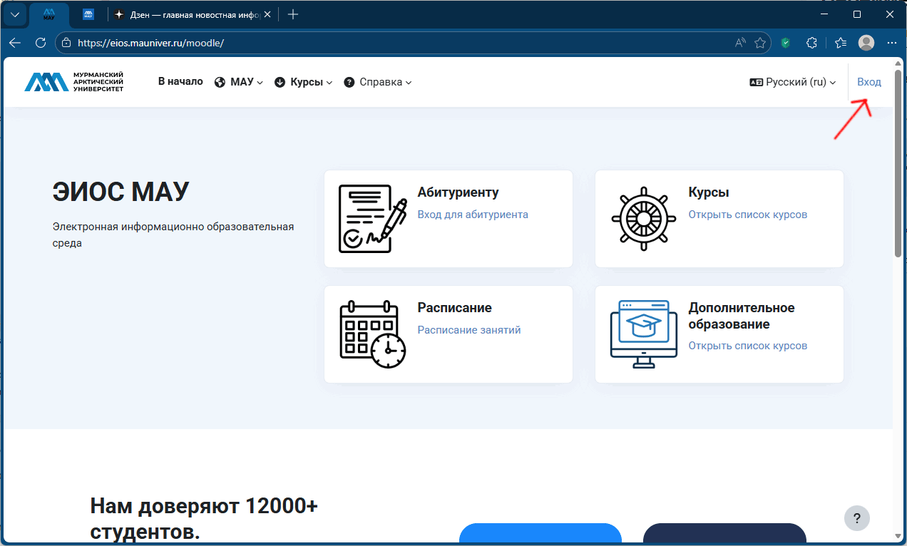

# Переименование курса

В <tooltip term="lms">СУО</tooltip> ЭИОС университета у каждого преподавателя-владельца курса имеются расширенные возможности по управлению своим курсом.

### 1. Переименование курса:
1. Перейдите на сайт ЭИОС и выполните вход.
2. Откройте свой курс.
   > Это можно сделать на странице личного кабинета в разделе **Недавно посещенные курсы** или через пункт горизонтального меню **Мои курсы**
3. Откройте страницу настроек вашего курса с помощю пункта горизонтального меню **Настройки**.
4. Введите в поле **Полное название курса** новое название вашего курса.
5. Сохраните внесенные изменения с помощью кнопки **Сохранить и показать** внизу страницы.

