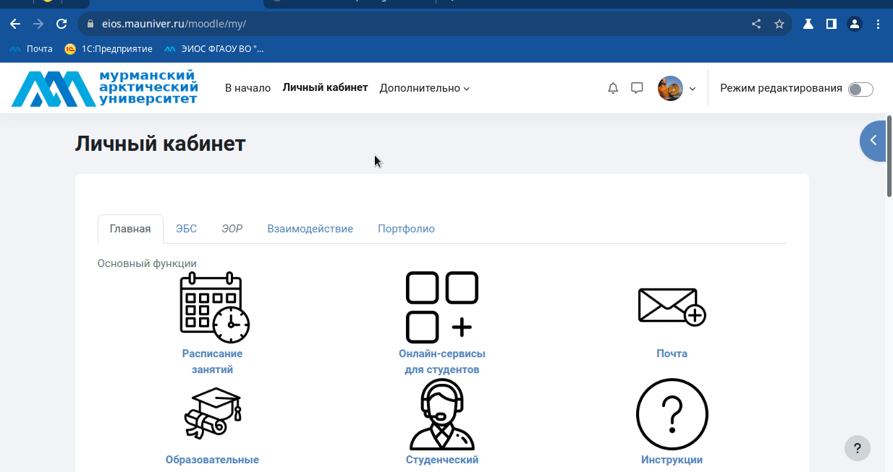

# Запрос на создание курса

В <tooltip term="lms">СУО</tooltip> ЭИОС университета присутствует встроенный механизм подачи заявок на создание курса, доступный любому пользователю.

### 1. Подача заявки из любого места СУО ЭИОС:
1. Перейдите на сайт ЭИОС и выполните вход.
2. Активируйте создание заявки в врхнем меню <tooltip term="lms">СУО</tooltip> ЭИОС **Курсы / Запрос на создание курса**
   > Если пункт меню **Курсы** по какой-то причине не отображется, то он скрыт внутри раздела **Дополнительно**
3. Введите в поле **Полное название курса** название курса в соответствии с учебным планом.
4. Введите в поле **Краткое название курса** сокращенное название курса, которое в последующем позволит вам его однозначно идентифицировать.
5. Выберите в поле **Категория курса** из списка направление подготовки для которого вы запрашиваете курс или иной подходящий раздел (в этом поле можно начать писать ключевое слово и система подскажет возможные варианты).
   > Если категория размещения не будет выбрана, то запрос на создание курса будет отклонён.

   > Если категория курса (конкретное направление подготовки) отсутствует в списке, то необходимо об этом написать в поле **Причины создания курса** и попросить создать отсутствующую категорию для конкретного направления подготовки
7. В поле **Описание** можно указать дополнительную информацию о курсе, например перечислить направления.
8. В поле **Причины создания курса** необходимо указать краткую причину например: распоряжение заведующего кафедрой, проректора по учебной работе, для поддержки дисциплины.
9. Завершит формирование запроса кнопкой **Отправить запрос на создание курса**.

                                         