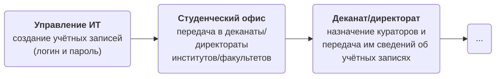
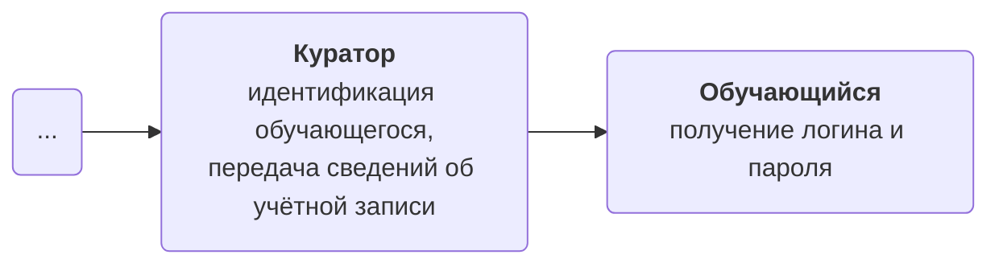
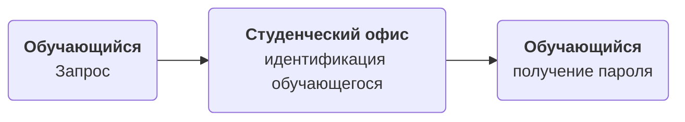
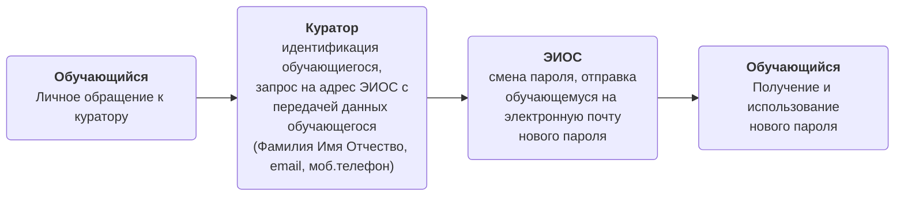
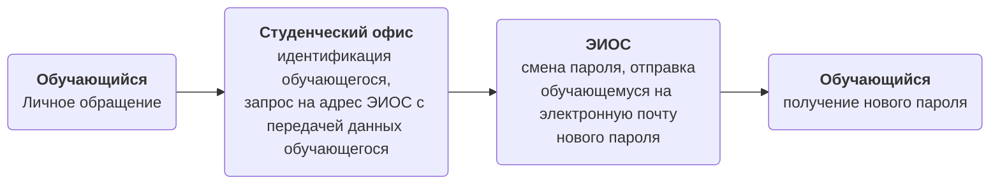
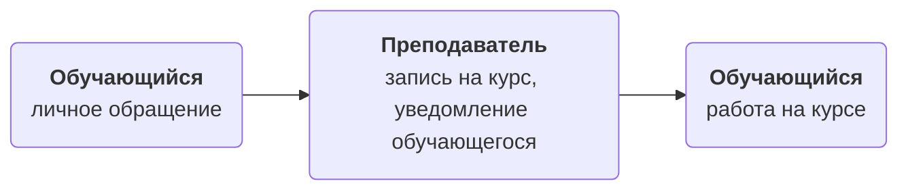
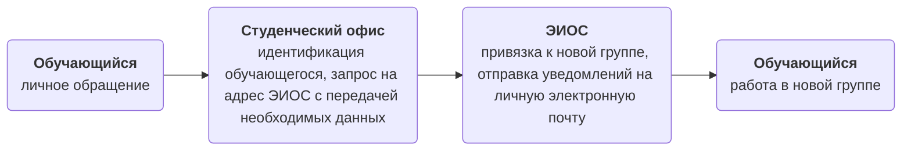

# Обучающемуся

# 1. Учётные записи обучающихся

## 1.1 Получение учётной записи обучающимся 1-го курса:

[//]: # (![img.png]&#40;img.png&#41;)

1. Подразделение университета ответственное за ведение реестра учётных записей обучающихся создаёт их и передаёт в **студенческий офис**.
2. **Студенческий офис** передаёт полученные сведения об учётных записях **деканам/директорам** факультетов/институтов, которые уже передают списки **кураторам** академических групп.
3. **Кураторы** академических групп проводят идентификацию обучающихся (по документу, подтверждающему личность) и передают **персонально** каждому студенту своей группы сведения об учётной записи.
4. Обучающийся получает от куратора сведения о своей учётной записи и уже персонально отвечает за их сохранность.

## 1.2 Повторная выдача сведений об учётной записи:

[//]: # (![img_1.png]&#40;img_1.png&#41;)

1. В случае потери сведений об учётной записи (логин, пароль) обучающемуся необходимо лично обратиться в **студенческий офис**.
2. **Студенческий офис** проводит идентификацию обучающегося (по документу, подтверждающему личность).
3. После идентификации обучающегося **студенческий офис** повторно выдаёт сведения об учётной записи.

## 1.3 Смена пароля:

*Вариант 1 (с помощью куратора)* 

[//]: # (![img_5.png]&#40;img_5.png&#41;)

1. В случае необходимости смены пароля обучающемуся необходимо лично обратиться к своему **куратору**.
2. **Куратор** проводит идентификацию обучающегося (по документу, подтверждающему личность).
3. После идентификации обучающегося **куратор** отправляет запрос на смену пароля на адрес <tooltip term="lms">СУО</tooltip> ЭИОС университета (%eios-email%) с передачей ФИО обучающегося, номера телефона и его личной электронной почты.
4. Подразделение университета, отвечающее за работу <tooltip term="lms">СУО</tooltip> ЭИОС устанавливает новый пароль и отправляет сведения об учётной записи на личную электронную почту обучающегося.

*Вариант 2 (с помощью специалиста студ.офиса)*

[//]: # (![img_4.png]&#40;img_4.png&#41;)

1. В случае необходимости смены пароля обучающемуся необходимо лично обратиться в **студенческий офис**.
2. **Студенческий офис** проводит идентификацию обучающегося (по документу, подтверждающему личность).
3. После идентификации обучающегося **студенческий офис** отправляет запрос на адрес <tooltip term="lms">СУО</tooltip> ЭИОС университета (%eios-email%) с передачей ФИО обучающегося, номера телефона и его личной электронной почты.
4. Подразделение университета, отвечающее за работу <tooltip term="lms">СУО</tooltip> ЭИОС устанавливает новый пароль и отправляет сведения об учётной записи на личную электронную почту обучающегося.

# 2. Доступ к курсу

[//]: # (![img_7.png]&#40;img_7.png&#41;)

1. Обратиться к преподавателю с просьбой о доступе к курсу.
2. Преподаватель подключает обучающихся одним из способов, который указан в [инструкциях для преподавателя](teacher.md).
3. Обучающемуся необходимо дождаться завершения процедуры организации доступа к курсу.

## 3. Смена группы

[//]: # (![img_6.png]&#40;img_6.png&#41;)

1. При смене учебной группы обучающемуся необходимо обратиться в **студенческий офис**
2. **Студенческий офис** проводит идентификацию обучающегося и формирует письмо-запрос на адрес <tooltip term="lms">СУО</tooltip> ЭИОС (eios@mauniver.ru) о переводе обучающегося в другую учебную группу. При этом в письме обязательно указываются следующие данные: ФИО обучающегося, исходная группа и целевая группа.
3. Подразделение университета, отвечающее за работу <tooltip term="lms">СУО</tooltip> ЭИОС меняет привязку обучающегося к академической группе и уведомляет его об этом с использованием почты, указанной у обучающегся в профиле ЭИОС.
