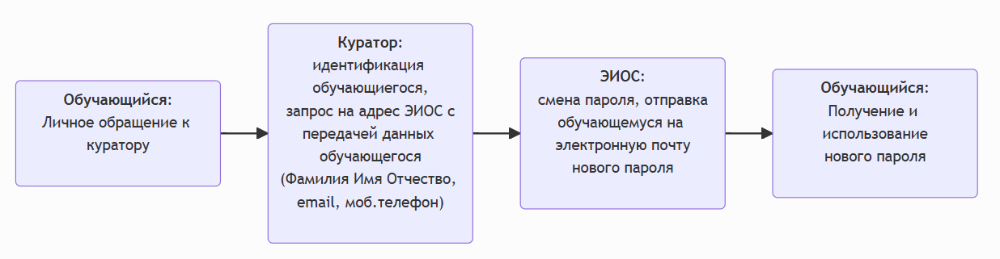
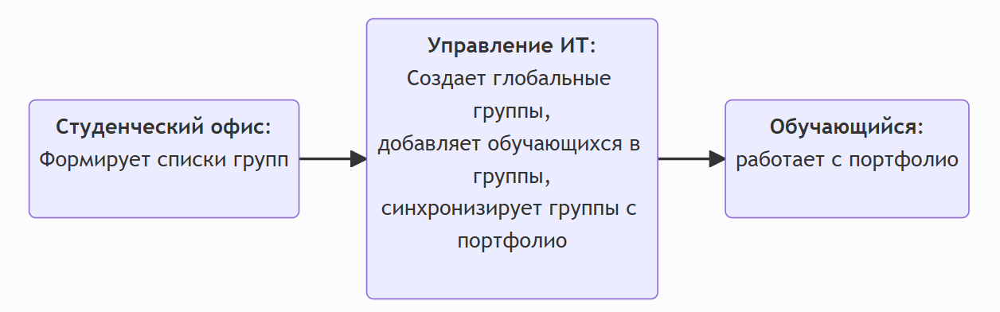

# Обучающемуся

## 1. Учётные записи обучающихся

### 1.1 Получение учётной записи обучающимся 1-го курса:

[//]: # (![img.png]&#40;img.png&#41;)


[//]: # (```mermaid)

[//]: # (flowchart LR)

[//]: # (    dep_it&#40;"`**Управление ИТ**:)

[//]: # (      создание учётных записей)

[//]: # (      &#40;логин и пароль&#41;`"&#41;)

[//]: # (      )
[//]: # (    dep_stof&#40;"`**Студенческий офис**:)

[//]: # (    передача в деканаты/директораты)

[//]: # (    институтов/факультетов`"&#41;)

[//]: # ()
[//]: # (    dep_dean&#40;"`**Деканат/директорат**:)

[//]: # (    назначение кураторов и)

[//]: # (    передача им сведений об учётных записях`"&#41;)

[//]: # (    )
[//]: # (    dep_next&#40;"..."&#41;)

[//]: # (    )
[//]: # (    dep_it-->dep_stof)

[//]: # (    dep_stof-->dep_dean)

[//]: # (    dep_dean-->dep_next)

[//]: # (```)


[//]: # (```mermaid)

[//]: # (flowchart LR   )

[//]: # (    dep_next&#40;"..."&#41;)

[//]: # ()
[//]: # (    dep_curator&#40;"`**Куратор**:)

[//]: # (    идентификация обучающегося,)

[//]: # (    передача сведений об учётной записи`"&#41;)

[//]: # ()
[//]: # (    dep_student&#40;"`**Обучающийся**:)

[//]: # (    получение логина и пароля`"&#41;    )

[//]: # (    )
[//]: # ()
[//]: # (    dep_next-->dep_curator)

[//]: # (    dep_curator-->dep_student    )

[//]: # (```)


1. Подразделение университета ответственное за ведение реестра учётных записей обучающихся создаёт их и передаёт в **студенческий офис**.
2. **Студенческий офис** передаёт полученные сведения об учётных записях **деканам/директорам** факультетов/институтов, которые уже передают списки **кураторам** академических групп.
3. **Кураторы** академических групп проводят идентификацию обучающихся (по документу, подтверждающему личность) и передают **персонально** каждому студенту своей группы сведения об учётной записи.
4. Обучающийся получает от куратора сведения о своей учётной записи и уже персонально отвечает за их сохранность.


### 1.2 Повторная выдача сведений об учётной записи:

[//]: # (![img_1.png]&#40;img_1.png&#41;)


[//]: # (```mermaid)

[//]: # (flowchart LR)

[//]: # (    dep_student&#40;"`**Обучающийся**:)

[//]: # (    Запрос`"&#41; )

[//]: # ()
[//]: # (    dep_stof&#40;"`**Студенческий офис**:)

[//]: # (    идентификация обучающегося`"&#41;)

[//]: # (    )
[//]: # (    dep_student2&#40;"`**Обучающийся**:)

[//]: # (    получение пароля`"&#41;    )

[//]: # (         )
[//]: # (    dep_student-->dep_stof)

[//]: # (    dep_stof-->dep_student2)

[//]: # (```)

1. В случае потери сведений об учётной записи (логин, пароль) обучающемуся необходимо лично обратиться в **студенческий офис**.
2. **Студенческий офис** проводит идентификацию обучающегося (по документу, подтверждающему личность).
3. После идентификации обучающегося **студенческий офис** повторно выдаёт сведения об учётной записи.

### 1.3 Смена пароля:

*Вариант 1 (с помощью куратора)* 

[//]: # (![img_5.png]&#40;img_5.png&#41;)



[//]: # (```mermaid)

[//]: # (flowchart LR)

[//]: # (    dep_student&#40;"`**Обучающийся**:)

[//]: # (    Личное обращение к куратору`"&#41; )

[//]: # ()
[//]: # (    dep_curator&#40;"`**Куратор**:)

[//]: # (    идентификация обучающиегося,)

[//]: # (    запрос на адрес ЭИОС с)

[//]: # (    передачей данных обучающегося)

[//]: # (    &#40;Фамилия Имя Отчество, email, моб.телефон&#41;`"&#41;)

[//]: # (      )
[//]: # (    dep_it&#40;"`**ЭИОС**:)

[//]: # (      смена пароля, отправка)

[//]: # (      обучающемуся на электронную почту)

[//]: # (      нового пароля`"&#41;)

[//]: # (    )
[//]: # (    dep_student2&#40;"`**Обучающийся**:)

[//]: # (    Получение и использование)

[//]: # (    нового пароля`"&#41;     )

[//]: # (    )
[//]: # (    dep_student-->dep_curator)

[//]: # (    dep_curator-->dep_it)

[//]: # (    dep_it-->dep_student2)

[//]: # (```)
1. В случае необходимости смены пароля обучающемуся необходимо лично обратиться к своему **куратору**.
2. **Куратор** проводит идентификацию обучающегося (по документу, подтверждающему личность).
3. После идентификации обучающегося **куратор** отправляет запрос на смену пароля на адрес <tooltip term="lms">СУО</tooltip> ЭИОС университета (esio@mauniver.ru) с передачей ФИО обучающегося, номера телефона и его личной электронной почты.
4. Подразделение университета, отвечающее за работу <tooltip term="lms">СУО</tooltip> ЭИОС устанавливает новый пароль и отправляет сведения об учётной записи на личную электронную почту обучающегося.

*Вариант 2 (с помощью специалиста студ.офиса)*

[//]: # (![img_4.png]&#40;img_4.png&#41;)


[//]: # (```mermaid)

[//]: # (flowchart LR)

[//]: # (    dep_student&#40;"`**Обучающийся**:)

[//]: # (    Личное обращение`"&#41; )

[//]: # ()
[//]: # (    dep_stof&#40;"`**Студенческий офис**:)

[//]: # (    идентификация обучающегося,)

[//]: # (    запрос на адрес ЭИОС с передачей данных обучающегося`"&#41;)

[//]: # (    )
[//]: # (    dep_it&#40;"`**ЭИОС**:)

[//]: # (      смена пароля, отправка)

[//]: # (      обучающемуся на электронную почту)

[//]: # (      нового пароля`"&#41;    )

[//]: # (    )
[//]: # (    dep_student2&#40;"`**Обучающийся**:)

[//]: # (    получение нового пароля`"&#41;    )

[//]: # (    )
[//]: # (    dep_student-->dep_stof)

[//]: # (    dep_stof-->dep_it)

[//]: # (    dep_it-->dep_student2)

[//]: # (```)

1. В случае необходимости смены пароля обучающемуся необходимо лично обратиться в **студенческий офис**.
2. **Студенческий офис** проводит идентификацию обучающегося (по документу, подтверждающему личность).
3. После идентификации обучающегося **студенческий офис** отправляет запрос на адрес <tooltip term="lms">СУО</tooltip> ЭИОС университета (%eios-email%) с передачей ФИО обучающегося, номера телефона и его личной электронной почты.
4. Подразделение университета, отвечающее за работу <tooltip term="lms">СУО</tooltip> ЭИОС устанавливает новый пароль и отправляет сведения об учётной записи на личную электронную почту обучающегося.

## 2. Доступ к курсу

[//]: # (![img_7.png]&#40;img_7.png&#41;)


[//]: # (```mermaid)

[//]: # (flowchart LR)

[//]: # (    dep_student&#40;"`**Обучающийся**:)

[//]: # (    личное обращение`"&#41; )

[//]: # ()
[//]: # (    dep_teacher&#40;"`**Преподаватель**:)

[//]: # (    запись на курс, уведомление обучающегося`"&#41; )

[//]: # (        )
[//]: # (    dep_student2&#40;"`**Обучающийся**:)

[//]: # (    работа на курсе`"&#41;    )

[//]: # (    )
[//]: # (    dep_student-->dep_teacher)

[//]: # (    dep_teacher-->dep_student2)

[//]: # (```)

1. Обратиться к преподавателю с просьбой о доступе к курсу.
2. Преподаватель подключает обучающихся одним из способов, который указан в [инструкциях для преподавателя](teacher.md).
3. Обучающемуся необходимо дождаться завершения процедуры организации доступа к курсу.

## 3. Смена группы

[//]: # (![img_6.png]&#40;img_6.png&#41;)


[//]: # (```mermaid)

[//]: # (flowchart LR)

[//]: # (    dep_student&#40;"`**Обучающийся**:)

[//]: # (    личное обращение`"&#41; )

[//]: # ()
[//]: # (    dep_stof&#40;"`**Студенческий офис**:)

[//]: # (    идентификация обучающегося, запрос на адрес ЭИОС с передачей необходимых данных`"&#41;)

[//]: # (    )
[//]: # (    dep_it&#40;"`**ЭИОС**:)

[//]: # (    привязка к новой группе, отправка уведомлений на личную электронную почту`"&#41;)

[//]: # (    )
[//]: # (    dep_student2&#40;"`**Обучающийся**:)

[//]: # (    работа в новой группе`"&#41;    )

[//]: # (         )
[//]: # (    dep_student-->dep_stof)

[//]: # (    dep_stof-->dep_it)

[//]: # (    dep_it-->dep_student2)

[//]: # (```)

1. При смене учебной группы обучающемуся необходимо обратиться в **студенческий офис**
2. **Студенческий офис** проводит идентификацию обучающегося и формирует письмо-запрос на адрес <tooltip term="lms">СУО</tooltip> ЭИОС ([eios@mauniver.ru](mailto:eios@mauniver.ru)) о переводе обучающегося в другую учебную группу. При этом в письме обязательно указываются следующие данные: ФИО обучающегося, исходная группа и целевая группа.
3. Подразделение университета, отвечающее за работу <tooltip term="lms">СУО</tooltip> ЭИОС меняет привязку обучающегося к академической группе и уведомляет его об этом с использованием почты, указанной у обучающегся в профиле ЭИОС.

## 4. Доступ к портфолио

*Вариант 1 (студенты 1-го курса, в начале учебного года)*



[//]: # (```mermaid)

[//]: # (flowchart LR)

[//]: # (    dep_stof&#40;"`**Студенческий офис**:)

[//]: # (    Формирует списки групп`"&#41;)

[//]: # ()
[//]: # (    dep_it&#40;"`**Управление ИТ**:)

[//]: # (      Создает глобальные группы,)

[//]: # (      добавляет обучающихся в группы,)

[//]: # (      синхронизирует группы с портфолио)

[//]: # (      `"&#41;)

[//]: # (      )
[//]: # (    dep_student&#40;"`**Обучающийся**:)

[//]: # (    работает с портфолио`"&#41;)

[//]: # (    )
[//]: # (    dep_stof-->dep_it)

[//]: # (    dep_it-->dep_student)

[//]: # (```)

1. Студенческий офис для всех студенто, поступивших на 1-й курс формирует списки групп и передает их в подразделение университета ответственное за ведение реестра учётных записей обучающихся (Управление ИТ). 
2. Сотрудники **Управление ИТ** создают в ЭИОС университета глобальные группы, добавляют в них обучающихся и синхронизируют эти группы с портфолио.
3. После этого обучающийся может загружать свои достижения в портфолио, которое доступно из личного кабинета.

*Вариант 2 (если нет доступа к портфолио)*


[//]: # (```mermaid)

[//]: # (flowchart LR)

[//]: # (    student1&#40;"`**Обучающийся**:)

[//]: # (    ответственному по СВР,`"&#41;)

[//]: # (    )
[//]: # (    curator&#40;"`**Куратор** или **Ответственный по СВР**:)

[//]: # (    запрос в **Управление ИТ**`"&#41;)

[//]: # (    )
[//]: # (    dep_it&#40;"`**Управление ИТ**:)

[//]: # (      анализ запроса,)

[//]: # (      добавление студента в глобальную группу`"&#41;)

[//]: # (      )
[//]: # (    student2&#40;"`**Обучающийся**: )

[//]: # (        работает с портфолио`"&#41;)

[//]: # (    )
[//]: # (    student1-->curator)

[//]: # (    curator-->dep_it)

[//]: # (    dep_it-->student2)

[//]: # (```)

1. В случае **отсутствия доступа** к портфолио **обукчющемуся** необходимо обратиться к своему **куратору** (или ответсвенному по СВР) с запросом на доступ к портфолио.
2. Куратор делает запрос на адрес ЭИОС "МАУ" ([eios@mauniver.ru](mailto:eios@mauniver.ru)) со своей **личной корпоративной почты** с указанием **полного ФИО** обучающегося и **названия академической группы** строго в соответствии с именованием групп в расписании.
3. Полученный запрос анализируется сотрудниками ИТ и в случае одобрения добавляют указанного в запросе обучающегося в глобальную группу.
4. После этого обучающийся может загружать свои достижения в портфолио.
