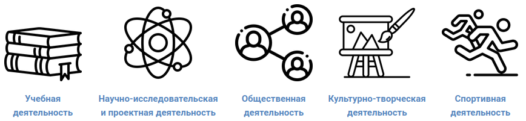

# Электронное портфолио обучающегося

**Инструкция для куратора**

## 1. Общие сведения о портфолио
В университете разработана и внедрена система электронного портфолио (ЭП) обучающегося
на базе системы управления обучением (СУО) ЭИОС "МАУ" и доступна с сайта университета по следующем пути
**Сервисы | Вход в ЭИОС МАУ | Личный кабинет | Портфолио**. 
Реализация ЭП на базе СУО предъявляет ко всем пользователям системы ЭП
обязательное требования - наличие учетной записи в учебном сегменте
локальной вычислительной (ЛВС) сети университета.

Система электронного портфолио обучающегося является отдельным курсом в СУО, содержащим требуемые по нормативным документам разделы:
- учебная деятельность;
- научно-исследовательская и проектная деятельность;
- общественная деятельность;
- спортивная деятельность.

Каждый из перечисленных выше разделов представляет собой элемент "База данных", который позволяет собирать информацию и осуществлять поиск по ней. Также имеется возможность экспорта собранной информации в формате электронной таблицы (LibreOffice Calc или Microsoft Office Excel) для последующего анализа.

Общий вид пиктограмм разделов представлен на приведенном ниже рисунке.

В ЭП выделяются следующие роли: обучающийся, куратор, ответственный по СВР.

- **Обучающиеся** получают доступ к портфолио путем записи их в глобальные группы в начале учебного года. В случае отсутствия обучающегося в одной глобальных групп обучающемуся необходимо обратиться в студенческий офис.
- **Кураторы** получают доступ к системе ЭП с использованием кодового слова куратора (получить можно у ответственого по СВР факультета/института).
- **Ответственный по СВР** получает доступ по запросу деканата/директората в **Управление ИТ**.

## 2. Работа с портфолио

#### 2.1 Регистрация в электронном портфолио в роли куратора

1. Получите кодовое слово куратора у ответственного по СВР вашего факультета/института.
2. Перейдите на страницу портфолио **сайт университета | Cервисы | Вход в ЭИОС МАУ | Личный кабинет | Портфолио**.
3. Введите кодовое слово куратора в одноименное поле и активируйте регистрацию с помощью кнопки Записаться на курс.

!!! note ""

    Если у вас нет поля для ввода кодового слова, то вас уже включили в группу кураторов. Повторный ввод не требуется

!!! danger ""

    Также вы можете обратиться к специалисту по СВР своего факультета/института с просьбой о доступе к портфолио. Каждому ответственному по СВР предоставлены все полномочия для выполнения такой операции.

#### 2.2. Модерация внесенной обучающимися информации
1. Перейдите в один из разделов ЭП, например Учебная деятельность.
2. Выберите свою группу в раскрывающемся списке Изолированные группы.
3. Переключитесь в режим работы Просмотр по одной записи с помощью одноименной кнопки.
4. Проверьте внесенную обучающимся информацию, удостоверьтесь в том, что прикрепленные файлы являются подтверждением внесенных сведений:  
- если внесенные обучающимися сведения достоверны, то одобрите их соответствующей кнопкой (цифра 1 на рис. ниже) и поставьте оценку (цифра 2 на рис. ниже)
- если внесенные данные не корректны, то напишите комментарий обучающемуся (цифра 3 на рис. выше).
5. Дополнительные возможности:
6. Экспортировать внесенную информацию из любого раздела портфолио (Раздел портфолио/Экспортировать).
7. Вы можете просмотреть результаты заполнения портфолио в оценочной ведомости (Этот курс/Оценки).

