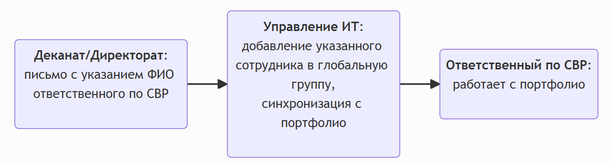
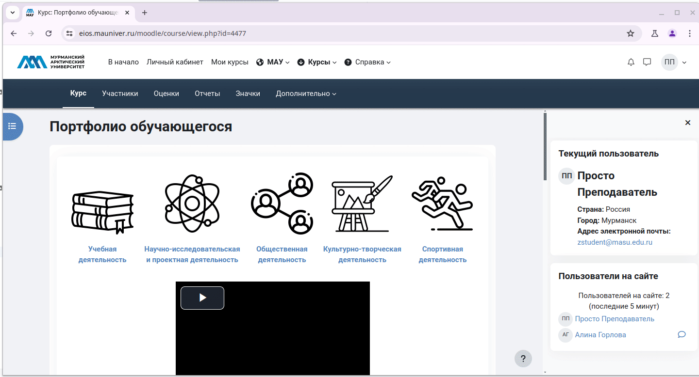

# Специалисту по СВР

Специалист по СВР обладает по сравнению с обучающимися и кураторами расширенными привилегиями. Кроме привилегий на добавление учащихся и кураторов в группы специалист по СВР обладает возможностями самостоятельного **создания** групп и их **удаления**. В связи с этим специалист по СВР должен внимательно следить за выполняемыми им операциями в электронном портфолио обучающегося. Специалист по СВР **не должен** выполнять каких-либо операций вне своего факультета/института.

## 1. Возможности
- Просмотр количества участников в каждой группе.
- Экспорт результатов достижений для каждого из разделов портфолио.
- Управление студентами и кураторами.

## 2. Доступ к портфолио

1. В начале учебного года деканат/директорат факультета/института направляют на адрес ЭИОС "МАУ" письмо с указанием полного ФИО ответственного по СВР.
   >Дополнительно могут быть указаны иные сотрудники деканата/директората для получения полномочий **Ответственного по СВР**  
2. Управление ИТ добавляет указанного ответственного по СВР в глобальную группу "Ответственные по СВР" и выполняет синхронизацию с портфолио.
3. Ответственный по СВР получает расширенные возможности в портфолио обучающегося




[//]: # (```mermaid)

[//]: # (flowchart LR)

[//]: # (    dean&#40;"`**Деканат/Директорат**:)

[//]: # (    письмо с указанием ФИО ответственного по СВР`"&#41;)

[//]: # (    )
[//]: # (    dep_it&#40;"`**Управление ИТ**:)

[//]: # (      добавление указанного сотрудника в глобальную группу,)

[//]: # (      синхронизация с портфолио`"&#41;)

[//]: # (      )
[//]: # (    teacher_svr&#40;"`**Ответственный по СВР**: )

[//]: # (        работает с портфолио`"&#41;)

[//]: # (    )
[//]: # (    dean-->dep_it)

[//]: # (    dep_it-->teacher_svr)

[//]: # (```)

## 3. Просмотр достижений обучающихся академической группы

1. Перейдите на страницу портфолио **Сервисы | Вход в ЭИОС МАУ | Личный кабинет | Портфолио** (при необходимости введите свой логин и пароль).
2. Перейдите в один из разделов портфолио, например в раздел **Учебная деятельность**. При этом вам будет доступны для просмотра достижения **всех** обучающихся университета.
3. Выберите в списке **Изолированные группы** интересующую вас академическую группу, например **ИПиП-БСО-ЛГП-20**
4. При наличии загруженных обучающимися достижения внизу отобразится таблица с печенем достижений.
5. Отобразивушуюся таблицу можно прокручивать:
      - по вертикали с помощью колеса прокрутки манипулятора мышь.
      - по горизонтали с помощью клавиш управления курсором на клавиатуре ++left++ ++right++

6. В последнем столбце **Управление** доступны кнопки с помощью которых можно:
      - отредактировать запись
      - просмотреть 
      - удалить
      - отклонить


## 4. Добавления куратора в группу
1. Перейдите в на страницу портфолио.
2. Откройте раздел управления участниками с помощью кнопки **Участники** в верхней части страницы.
3. В списке **Зачисленные на курс пользователи** выберите **Группы** для перехода в одноимённый раздел.
4. Найдите в списке Группы ту, в которую требуется добавить куратора  и щелкните по ней для активации.
5. Откройте диалоговое окно добавления пользователя в группу с помощью кнопки **Добавить/удалить участника**.
6. Начните вводить в поле **Найти** фамилию куратора и выберите его, щелкнув по его фамилии в списке **Возможные участники**.
7. Добавьте выбранного куратора с помощью кнопки **Добавить** (с помощью кнопки **Удалить** можно исключить куратора из группы). 


## 5. Просмотр состава групп для факультета/института
1. Перейдите в на страницу портфолио.
2. Откройте раздел управления участниками с помощью кнопки **Участники** в верхней части страницы.
2. В списке **Зачисленные на курс пользователи** выберите **Обзор** для перехода в одноимённый раздел.
3. Выполните фильтрацию информации только для вашего факультета/института с помощью списка **Фильтр групп по...**
4. С помощью спика **Группа** можно просмотреть состав одной группы. 


## 6. Просмотр наполняемости портфолио
1. Перейдите в на страницу портфолио.
2. Пролистайте страницу вниз до пункта **Статистика по портфолио для кураторов** и перейдите в него
3. Выберите в раскрывающемся списке факультет/институт при этом отобразится список групп с дополнительной информацией по каждой из них:
      - куратор (если он был добавлен в группу)
      - добавлено достижений: 0 (добавленные обучающимися достижения)
      - проверено: 0 (количество одобренных куратором достижений)



## 7. Экспорт результатов достижений для каждого из разделов портфолио
1. В портфолио обучающегося перейдите в один из его разделов, например **Научно-исследовательская и проектная деятельност**ь.
2. Перейдите в подраздел **Экспортировать**.
3. Выберите интересующую вас академическую группу в списке **Изолированные группы**.
4. Укажите формат экспорта.
5. Выберите поля данных для экспорта.
6. Осуществите экспорт данных кнопкой Экспорт записей.
7. После этого у вас произойдет скачивание файла табличного процессора, который можно открыть в LibreOffice Calc или Microsoft Office Excel и выполнить самостоятельно анализ.
